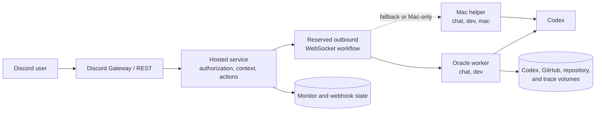

# Architecture

MiniSago separates Discord-facing authority from model execution. The hosted
service owns identity, permissions, context retrieval, and Discord mutations;
Codex runs on authenticated workers that connect outbound to the service.

## Deployment topology

No worker port is public. Oracle is the preferred always-on worker. The Mac
helper is a fallback and the only profile with access to explicitly requested
local Mac resources.

## Components

### Hosted service

The Bun service handles:

- Discord Gateway events, REST calls, and GitHub webhooks;
- chatbot authorization and requester-visible channel filtering;
- nearby context, history search, member aliases, and bounded Discord actions;
- worker authentication, reservation, routing, timeouts, and result delivery;
- scheduled reminders, vocabulary posts, and feed monitors; and
- persistent monitor and webhook state.

### Workers

Both workers run ephemeral Codex jobs with isolated configuration. Their
profiles are assigned by the bridge secret rather than advertised by the
worker:

| Profile | Capabilities         | Selection                               |
| ------- | -------------------- | --------------------------------------- |
| Oracle  | `chat`, `dev`        | Preferred when compatible and available |
| Mac     | `chat`, `dev`, `mac` | Fallback or explicit Mac target         |

Workers advertise only capacity, repository availability, and the repository
that owns chatbot behavior. A workflow remains reserved on one worker through
routing, evidence retrieval, and answering unless its required profile changes.

## Chat request lifecycle

1. The Gateway receives a human message and determines whether it is a mention,
   reply continuation, owner direct message, or timed follow-up.
2. The hosted service authorizes the requester and gathers nearby messages.
3. It reserves a compatible worker and registers a short-lived, bearer-bound
   MCP session. Owner requests first run a bounded router with the session's
   filtered capability catalog. The router keeps host-tool actions and uncertain
   requests in `chat`, selects `mac` for explicit Mac resources, or selects
   `oracle` with one repository for development work.
4. The service routes the reserved workflow when needed and dispatches one
   answer job with the executable MCP session.
5. Codex receives the request, nearby context, and supported answer attachments.
   It may call `resolve_context` for more history, accessible guild search,
   member aliases, or the previous observable trace.
6. Codex returns a structured reply and optional reaction or Mac file. The
   hosted service validates and posts the result to Discord.
7. The MCP token is revoked and the worker reservation is released.

Community and owner chat use GPT-5.6 Luna with high reasoning. The owner router
uses Luna with low reasoning; selected development work uses GPT-5.6 Sol with
medium reasoning. Ordinary stages have a two-minute timeout, while final owner
development answers may run for 15 minutes.

## Context and MCP

The hosted service exposes one Streamable HTTP MCP endpoint. Tokens are created
for one active workflow, expire after 16 minutes, and cannot select another
requester, guild, channel, worker profile, or repository.

The consolidated `resolve_context` tool can request, in parallel:

- additional current-channel history;
- searches across requester-visible guild channels;
- server aliases for named members; and
- bounded metadata about the previous answer.

Other tools cover Codex usage, reminders, voice, owner channel messages, and
owner emoji and sticker creation. A persisted feature policy controls guild
and channel coverage. Owner-only MCP tools update it without a deployment;
channel rules take precedence over guild rules. Where the trip planner is
enabled, host-bound tools read the shared itinerary and apply typed schedule
edits through the planner API. They never expose database credentials or
accept a guild argument. The host injects a request-scoped capability catalog
into the answer context. It includes conversation, attachment, reaction,
development, Mac, and MCP capabilities. Owner features are omitted for other
requesters, and capabilities that need a routed worker or explicit request are
marked conditional. Discord identity and destinations remain bound by the host
wherever possible.

An independent persisted subscription list controls the destination channels
for Gamer Forum, X repost, and TOEFL background services. Owner-only MCP tools
list those destinations with Discord channel mentions and add or remove a
channel. Scheduled jobs read the current subscriptions before delivery, so a
change does not require a process restart.

Linux answer jobs also receive a worker-local stdio MCP server for media in the
active request. Attachments, resolved member avatars, and generated outputs all
use the same opaque `mediaId` interface, so one tool's output can be passed
directly to another media or Discord tool. Typed tools inspect media, transform
images, extract video frames, and produce bounded MP4, MP3, or GIF artifacts
through fixed FFmpeg presets. The worker can exchange bytes only with the
bearer-bound request media endpoint; it accepts no paths, URLs, or arbitrary
network destinations. The server, token, and local manifest are request-scoped.

Ordinary answer jobs also connect to the public NTHU Campus Assistant MCP at
`https://api.nthusa.tw/mcp`. Its read-only tools cover campus search, buses,
courses, announcements, dining schedules, library information, newsletters,
and electricity usage. The server is optional, so an upstream outage does not
prevent MiniSago from answering unrelated requests.

Reminder identity and destination are fixed to the requester and current
channel. Relative timers need no timezone; wall-clock and recurring requests
require an IANA timezone or an unambiguous location. Each requester may keep at
most 50 active reminders.

Persisted reminders may include `skipIfImagePosted: { threadId, userId }`.
Before sending, the host checks that thread belongs to the reminder's channel
and scans its messages back to midnight in the reminder's timezone (Asia/Taipei
for legacy reminders). An image attachment or image embed from the specified
user skips that occurrence; the recurring schedule still advances normally.
Discord lookup failures leave the occurrence due for retry. Ordinary content
or schedule edits preserve the condition. This condition is configured in
durable state by an operator, not through the reminder chat tools.

## Prompt harness and context policy

Workers compile every model call into three explicit authority layers:

1. stable MiniSago policy and the selected capability mode are passed as Codex
   developer instructions;
2. a short, fixed instruction states the task for answering, routing, or social
   action; and
3. the current request, Discord messages, attachments, repository choices, and
   tool results are labeled as untrusted context.

Codex receives the task as its prompt and the context over standard input.
Implicit repository instruction discovery is disabled for worker jobs, so files
such as `AGENTS.md` remain repository data unless the owner explicitly asks to
work with them. Mechanical permissions, MCP session binding, command wrappers,
and output schemas continue to enforce capabilities outside the prompt.

Initial messages, each message, extracted attachment text, and resolved MCP
context have deterministic character budgets in
`contracts/context-budget.ts`. Selection keeps the newest messages, truncates
oversized items, and emits `context_omissions_json` metadata rather than hiding
loss. Taiwanese slang reference material is loaded only when Chinese appears in
the active context; identity, trust, and output policy always remain loaded.

Answer jobs also carry host-derived addressing metadata that records whether
the current request reached MiniSago through a mention, reply, owner DM, or
active-conversation continuation. The prompt uses that signal together with
message roles, reply links, and antecedents to resolve second- and third-person
references without treating Chinese grammatical gender as identity evidence.
The answer schema requires a bounded `referenceResolution` classification so
the reply stays consistent with that decision; the gateway consumes only the
reply and reaction fields and does not post the classification to Discord.

The worker and host also enforce MiniSago's first-person identity at the answer
boundary. A genuine self-introduction marks only the self-name in structured
reply text; the host validates and removes that marker before posting. An
unmarked self-name triggers one tool-free, networkless repair pass that may
rewrite the reference as first person or mark a genuine introduction. The
worker rejects the answer if the repaired reply still violates the identity
contract.

Policy, task, and context formats have independent versions. Traces record
those versions and layer sizes, but never private reasoning. Prompt-injection
and budget cases are covered by structural evaluations in
`worker/src/prompts/prompt-plan.test.ts`.

Worker jobs keep Codex's own memories off. The hosted service instead owns a
small curated memory file for each Discord guild. Current-guild entries are
injected into the untrusted context layer with stable IDs and a hard character
limit; they can describe server vocabulary and conventions but cannot change
identity, policy, permissions, or authorization. The answering model proactively
curates durable server knowledge, treating explicit teaching and corrections
from any authorized server member as strong signals while rejecting temporary,
uncertain, sensitive, or behavioral content. The guild-bound add, replace, or
remove tool records the requester and request message as provenance and never
accepts a guild ID from the model.

Guild memory lives under the persistent state volume as human-readable
Markdown. Atomic writes are serialized and committed to an independent
local-only Git repository for diff and rollback history; no remote is
configured. Conversation history remains request-scoped Discord context, while
sanitized operational traces are retained locally for 14 days and exposed only
as bounded metadata when a requester asks about a previous answer.

## Background features

The Gateway also handles Instagram link replies, quick-reply nudges, voice
state, and optional ambient reactions. Ambient messages are buffered without a
model call; a bounded delayed evaluation may add at most one validated reaction
and never produces an unsolicited reply.

Scheduled monitors and the GitHub webhook use persistent files for idempotency.
See [Configuration](configuration.md#persistent-state) for their paths and
[Operations](operations.md) for deployment and recovery.
